# Defining Data Science and What Data Scientist Do

In this module, you will view the course syllabus to learn what will be taught in this course. You will hear from data science professionals to discover what data science is, what data scientists do, and what tools and algorithms data scientists use on a daily basis. Finally, you will complete a reading assignment to find out why data science is considered the sexiest job in the 21st century.

### Learning Objectives

- Define data science and its importance in today’s data driven world.
- List some paths that can lead to a career in data science.
- Summarize advice given by seasoned data science professionals to data scientists who are just starting out.
- Articulate why data science is considered the most in-demand job in the 21st century.
- Describe what a typical day in the life of a data scientist looks like.
- Define some of the commonly used terms in data science.
- Summarize the impact of cloud technologies on data science.
- Identify some of the key qualities of a successful data scientist.

### Q. What is Data Science?

**Ans :**  Defining Data Science :

1. **Data Science is a process, not an event.** It is a process of **using data to understand different/various things**. It is **tool to understand the world.**

2. A **way to validate real-world issues, problems, models or hypothesis using the data** available to you.

3. It is the **art for uncovering the insights and trends that are hiding behind the data**.

4. Data can be **translated into a story, use storytelling to generate insights and using these insights we can make better strategies, choices for a company or an institution and can make better data driven decisions.**

5. It is a **field about processes and systems to extract data from various forms, of whether it is having un-structured (or) structured form**.

6. In layman terms, **data science is the study of data** like biological sciences is a study of biology, physical sciences, it's the study of physical reactions. Data is real, **data has real properties** and we need to study them and work on them.

7. Data science involves data and some science. The definition (or) the name coined in 80s and 90s when some professors were looking into the statistics curriculum, and they thought it would be better to call it as data science.
**Data science as one's attempt to work with data, to find anwsers to questions that they are exploring**. 
    - In a nutshell, it's more about data than it is about science.
    - Having data and having curiosity, to working with data and manipulating it, exploring it, analyzing it for getting anwsers to your questions from it it is called Data science.
    - Data science in modern context is a highly relevant field and previously we used to worry about lack of data but now we have data deluge. In past we didn't have algorithms and now, we have python, R, Machine learning, Deep learning having methods and algorithms. In past doftwares were expensive now, it is opensource and free. In past, we could'n'y store large amounts of data, now for a fraction of cost we can have gazillions of datasets for very low cost.

    - So tools to work with data, availibilty of data, ability to store and analyze data, its all cheap, it's all available, it's all ubiquitous.

### Fundamentals of Data Science

- In modern algorithms times, the vast quantity of data and it's availibility form massively varied sources. examples : log files, e-mail, social media, sales data, patient information files, sport performance data, sensor data, security cameras live data and many more besides,

- At the same times we have more data avialiable than ever and we  need the computing power to make useful analsis for this huge amount of data and new knowledge.

**Data science can helps Organizations :**
- Understand their environment. 
- Analyze existing issues.
- reavel previously hidden opportunities.

Data scientist use data analysis to add to the knowledge (value) of the organization (Business) by investigating data, exploring the best way to use it to provide value to the business.

***What is the process of Data science?***

***Ans :*** Many organizations will use data science to focus on a specific problem that the organization and it is essential to clarify the question that the organization
that the organization wants answered. This is the first step of the data science process.
s.
> 1. Clarify the questions that the organization wants to be answered. data scientist are the curious people, who ask questions for clarifying the businness need

***What data do we need to solve the problem? and From where will that data come from***

***Ans :*** Data scientist can analyse structure an dun-structure data from many sources and, depending upon the nature of the problem, they analyze data in different ways

    Explore the patterns and outliers

    Sometimes, it confirms what the oeganization suspects. but siometimes it is completely new knowledge, leading to a completely new apporach.

    When data reveals insights, the role of data scientist is to become a storyteller, communicating through results to the project stakeholder

    Datascientists can : 

        - Use powerful data visualization tools to help the stakeholder 
        
        - Understand the nature of the results.

        - And the recommended actions to take.

### Summary

- Data science is the study of large quantities of data, which can reveal insights that help organizations make strategic choices.

- There are  many paths to a career in data science; most, but not all, involve a little math, a little science, and a lot of curiosity about data.

- New data scientists need to be curious, judgemental and argumentative.

**Why data science is considered the sexiest job in the 21st century**, becuase of paying high salaries for skilled workers.

Organizations can leverages the atmost unlimited amount of data now available to them in a growing numbers of ways.

### Case study 1 Transportation - UBER

In transport, Uber collects real-time user data,

for figuring out (or) to discover how many drivers are available,

if more needed, and if they should allow a surge charge to attract more drivers

Uber uses data 

to put the right numbers of drivers in the right place, at the right time to riders who are willing to pay.

### Case study 2 Transportation - Toronto Transportation Commission.
 
The toronto transport commission has great strides in solving an old problem with traffic flowss, re-structing those flows in and around the city, using data science tools and analysis they have gathered data to better understand street car operations, and identify areas for interventions.
  

Analyze custormer complaints data, Used probe data to better understand traffic performance on main route and created a team bto etter capitalize on big data for
- planning, operations and evaluation

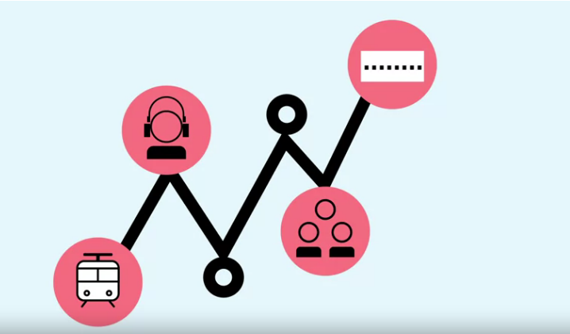

- By focusing Peak hour clearances and identifying the most congested route, montly hours lost for commuters due to traffic congestion  dropped from 4.75 hours in 2010 to 3 hours in mid 2014.

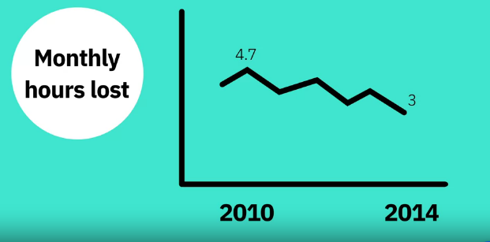

### Case study 3 Environment - Fresh Water lake and Problem of cyanobacterial blooms.
 

In facing issues in our environment, data science can play a pro-active role.

- They supply a variety of human and ecological needs, such as providing drinking water and food.

But lakes across the world are threated by the increase incidences of harmful cyanobacterial bloom.

There are many projects and studies to solve this long-existig dilemma.

In the US, a team of scientists from research centers stretching from Maine to south Carolina is developing high-tech tools to explore cyanobacteria in lakes across the east coast.

Team uses:
- Robotic boats
- buoys
- Camera-equipped drones

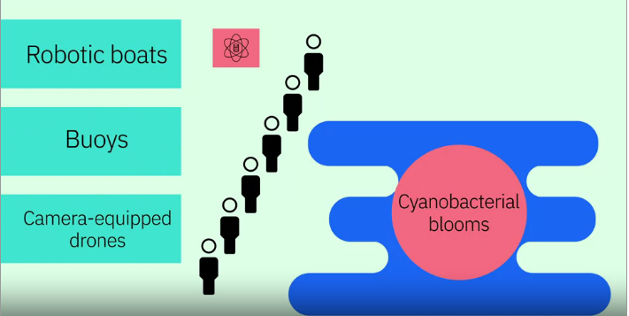

for measuring the Physical, chemical and biological data in lakes where cyanobacteria are detected, collecting large volumes of data related to the lakes and the development of the harmful blooms.

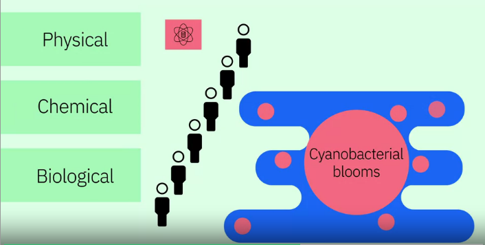

The project is also building new algorithmic models to assess the findings. the information collected will lead to better understanding/predictions of when and where cyanobacterial blooms take place, enablinq pro-active appreoaches to project public health in recreational lakes and, in those that supply drinking water.

Data Science : It takes gathering a lot of data, cleaning and preparing it, and then analyzing it to agin insight needed to develop better solutions for today's enterprises.

## Cloud for Data Science

- Cloud is godsent for data scientists, primarily because you're abe to take [the] your data, take your information and put it in the Cloud, put in a central storage system, It allows you to bypass the physical limitations of the computers and the systems you're using and it allows you to deploy the analytics and storage capacities of advanced machines that do not necessarily have to be your machine (or) your company's machine. 

- Cloud allows you not just to store large amounts of data on servers somewhere in california (or) in Nevada, but it also allows you to deploy very advanced computing algorithms and, the ability to do high-performance computing using machines that are not yours.

- Cloud allows you to work on the same data were your collegues are working from different regions of the world.

- Using the cloud, it enables you to get instant access to open source technologies like Apache spark without need to install and configure them locally.

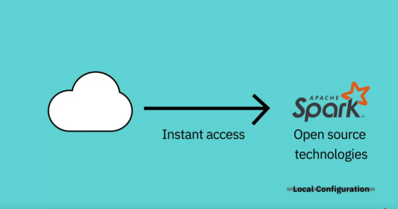

- Using the cloud also gives you access to the most up-to-date tools and libraries without worry of maintaining them and ensuring that they are up to date.

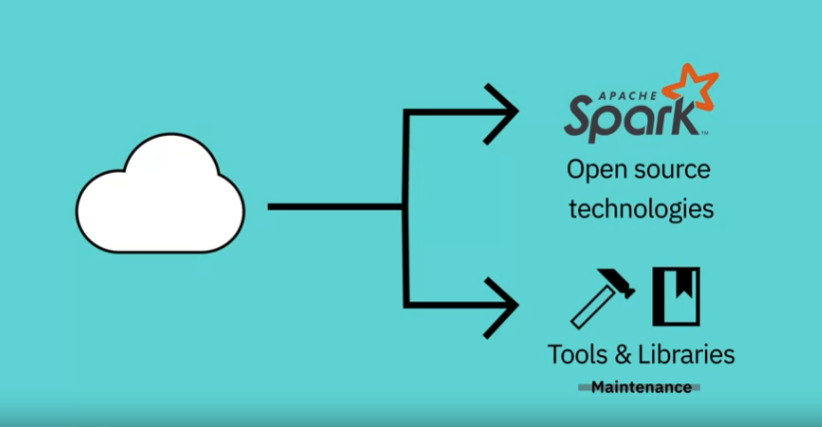

- Cloud is accessible from everywhere and in every time zone. you use cloud based technol.ogies from your laptop, desktops, tablets, mobiles, smart watches etc.,

it enables collaboration more easily that ever before. Multiple collaborators canm access the data simultaneouly, 

working together on producing a solution.

Some big tech companies offers cloud platforms, IBM offers the IBM cloud, Amazon offers Amazon Web Services (or) AWS, and Google offers Google Cloud Platfor (or) GCP.

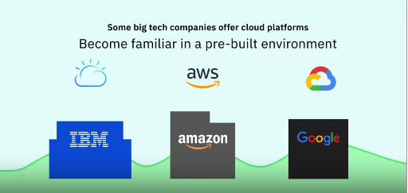

IBM also provide Skills Network Labs to learners  reqistered at any of the learning portals on the IBM Developer Skills Network. Where Developers can access of tools like Jupyter Notebook and Spark cluster so you can create your datascience project and develop solutions.

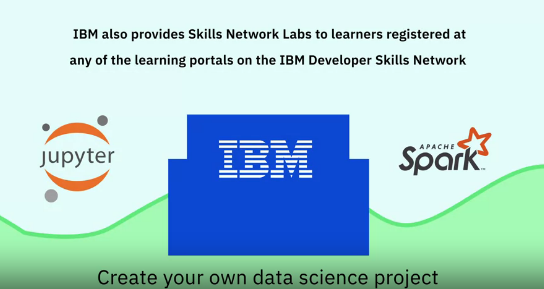

with practice and familiarity, developers discovered that the cloud dramatically enhances productivity for data scientists.

## Foundations of Big Data

The number of devices that are connected to internet are rapidly increases, that we interact with on a daily basis record vast amounts of data about us, it is named as Big Data.

**Definition of Big Data :** Big Data refers to the dynamic, large and disparate volumes of data being created by people, tools, and machines. It requires new, innovative, and scalable technology to collect, host, and analytically process the vast amount of data gathered in order to derive real-time business insights that relate to consumers, risk, productivity management, and enhanced shareholder value" - **Ernst and Young**

**Certain Common elements :**

There is no definition of Big data but there are certain elements common across the different definitions, such as velocity, volume, variety, veracity, and value. There are V's of Big data.

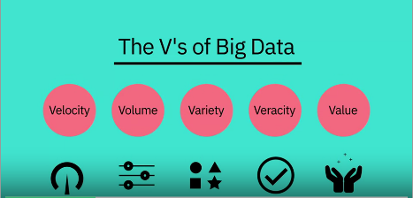

**Velocity :** It is the speed at which data accumulates.

* Data is being generated extremely fast, in a process that never stops.

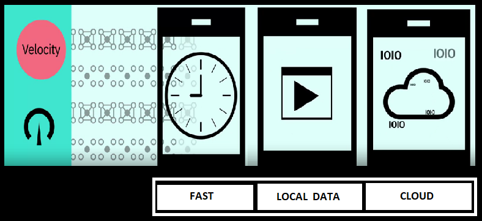

Near (or) real time streaming, local, and cloud-based technologies can process information very quickly

**Volume :** It is the scalle of the data, (or) the increasenin the amount of data stored.

Drivers : Drivers of volumne are the increase in data sources, higher resolution sensors, and scalable instrasture.

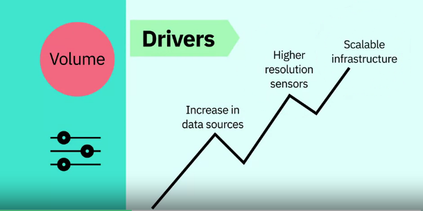

**Variety :** It is the diversity of the data.

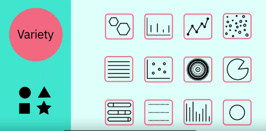

1. **Structure data :** It fits neatly into rows and columns, in relational databases.

2. **Unstructure data :** It is not organized in a pre-defined way, like 

    
1. Tweets, 

    
2. blog posts,

3. pictures, 

4. numbers,

5. Videos

Variety also reflects that data comes from different sources, machines, people, and processes, both internal and external to organizations.

Drivers are mobile technologies, social media, wearable technologies, geo technologies, video, and many more.

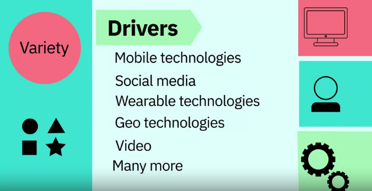

**Veracity :** It is the quality and origin of data, its conformity to facts and accuracy.

Attributes include consistency, completeness, integrity, and ambiguity.

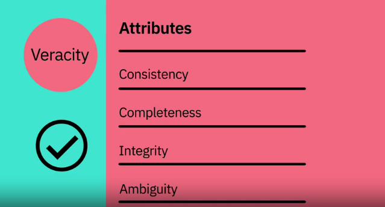

Drivers includes cost and the need for traceability.

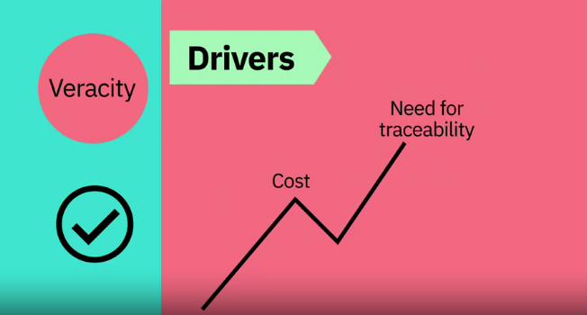

With large amount of data available, the debate rages on about the accuracy of data.