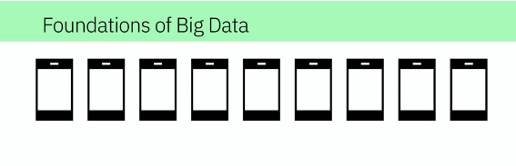
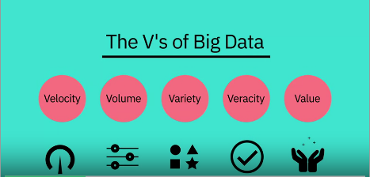
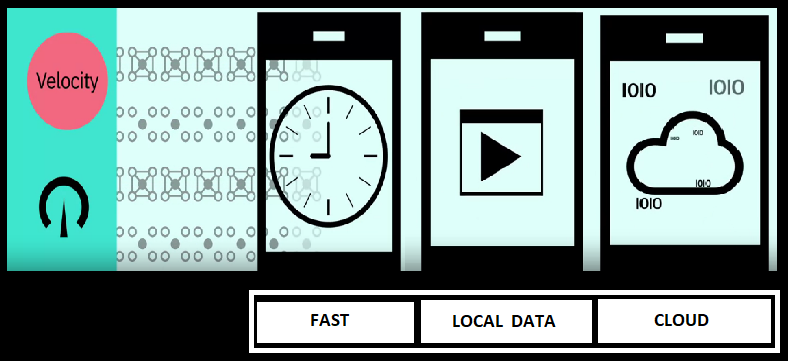
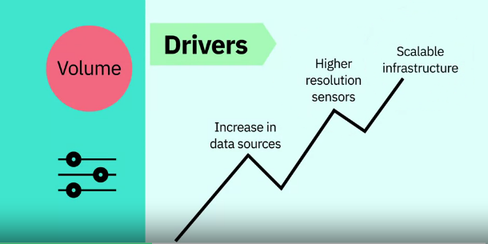
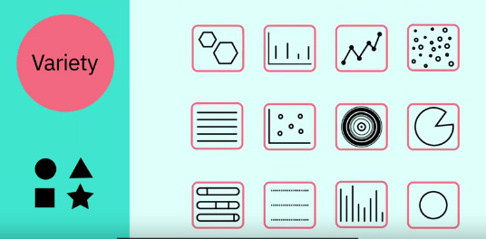
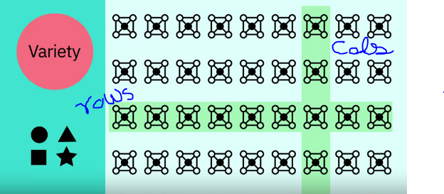
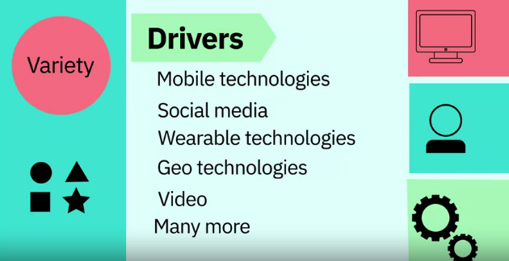
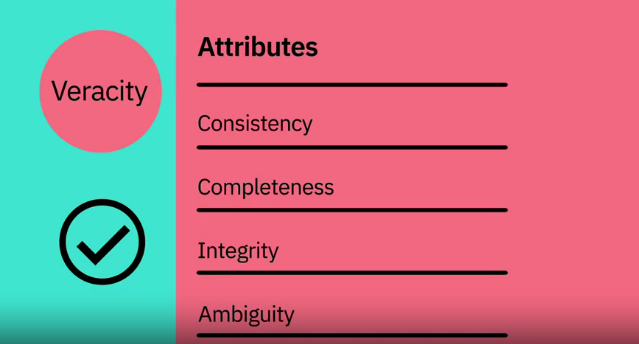
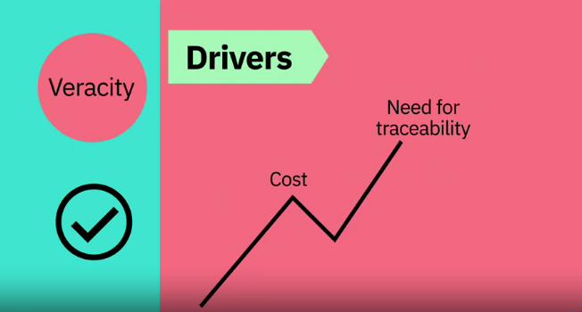

# Foundations of Big Data

The number of devices that are connected to internet are rapidly increases, that we interact with on a daily basis record vast amounts of data about us, it is named as Big Data.

**Definition of Big Data :** Big Data refers to the dynamic, large and disparate volumes of data being created by people, tools, and machines. It requires new, innovative, and scalable technology to collect, host, and analytically process the vast amount of data gathered in order to derive real-time business insights that relate to consumers, risk, productivity management, and enhanced shareholder value" - **Ernst and Young**

**Certain Common elements :**

There is no definition of Big data but there are certain elements common across the different definitions, such as velocity, volume, variety, veracity, and value. There are V's of Big data.

**Velocity :** It is the speed at which data accumulates.

* Data is being generated extremely fast, in a process that never stops.

Near (or) real time streaming, local, and cloud-based technologies can process information very quickly

**Volume :** It is the scalle of the data, (or) the increasenin the amount of data stored.

Drivers : Drivers of volumne are the increase in data sources, higher resolution sensors, and scalable instrasture.

**Variety :** It is the diversity of the data.

1. **Structure data :** It fits neatly into rows and columns, in relational databases.

2. **Unstructure data :** It is not organized in a pre-defined way, like 

    
1. Tweets, 

    
2. blog posts,

3. pictures, 

4. numbers,

5. Videos

Variety also reflects that data comes from different sources, machines, people, and processes, both internal and external to organizations.

Drivers are mobile technologies, social media, wearable technologies, geo technologies, video, and many more.

**Veracity :** It is the quality and origin of data, its conformity to facts and accuracy.

Attributes include consistency, completeness, integrity, and ambiguity.

Drivers includes cost and the need for traceability.

With large amount of data available, the debate rages on about the accuracy of data.