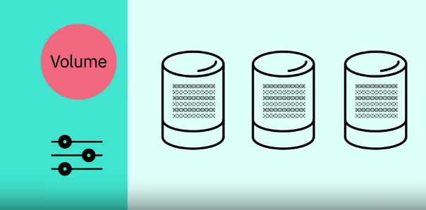
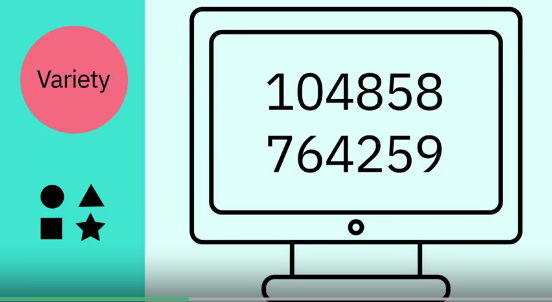

# Foundations of Big Data

The number of devices that are connected to internet are rapidly increases, that we interact with on a daily basis record vast amounts of data about us, it is named as Big Data.

**Definition of Big Data :** "Big Data refers to the dynamic, large and disparate volumes of data being created by people, tools, and machines. It requires new, innovative, and scalable technology to collect, host, and analytically process the vast amount of data gathered in order to derive real-time business insights that relate to consumers, risk, productivity management, and enhanced shareholder value" - **Ernst and Young**

**Certain Common elements :**

There is no definition of Big data but there are certain elements common across the different definitions, such as velocity, volume, variety, veracity, and value. There are V's of Big data.

**Velocity :** It is the speed at which data accumulates.

* Data is being generated extremely fast, in a process that never stops.

Near (or) real time streaming, local, and cloud-based technologies can process information very quickly

**Volume :** It is the scalle of the data, (or) the increasenin the amount of data stored.

Drivers : Drivers of volumne are the increase in data sources, higher resolution sensors, and scalable instrasture.

**Variety :** It is the diversity of the data.

1. **Structure data :** It fits neatly into rows and columns, in relational databases.

2. **Unstructure data :** It is not organized in a pre-defined way, like 

    
1. Tweets, 

    
2. blog posts,

3. pictures, 

4. numbers,

5. Videos

Variety also reflects that data comes from different sources, machines, people, and processes, both internal and external to organizations.

Drivers are mobile technologies, social media, wearable technologies, geo technologies, video, and many more.

**Veracity :** It is the quality and origin of data, its conformity to facts and accuracy.

Attributes include consistency, completeness, integrity, and ambiguity.

Drivers includes cost and the need for traceability.

With large amount of data available, the debate rages on about the accuracy of data in the digital age, is the information, real (or) is it is False?

**Value :** Value is our ability and need to turn data into value.

Value isn't just profit

It may have medical and social benefits, as well as customer, employee (or) personal satisfaction.

The main reason that why people invest time on understanding Big data is to derive values from it.

## Examples of V's in action:

1. **Velocity :** Every 60 seconds, hours of footage are uploaded to YouTube which is generating data

See how quickly data accumulate in hours, days, months and years.

2. **Volume :** the world population is approximately 7 billion people and the vast majority are now using digital devices; 

1. mobile phones, 
2. desktop and laptop computers, 
3. wearable devices and tablets.

These devices all generate, capture, and store data - approximately 2.5 quintillion bytes
that is equivalent to 10 million Blu-ray DVD's 

3. **Variety :** Let's think aboout different types of data; text,pictures, films, sound, health data from wearable devices, and many different types of data from devices connected to the Internet Of Thinks (IOT)

4. **Veracity :** 80% of data is considered to be unstructured and we must devise ways to produce reliable and accurate insights.

The data must be categorized, analyzed and visualized

