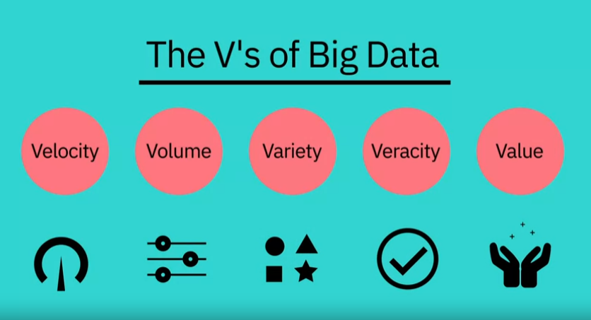
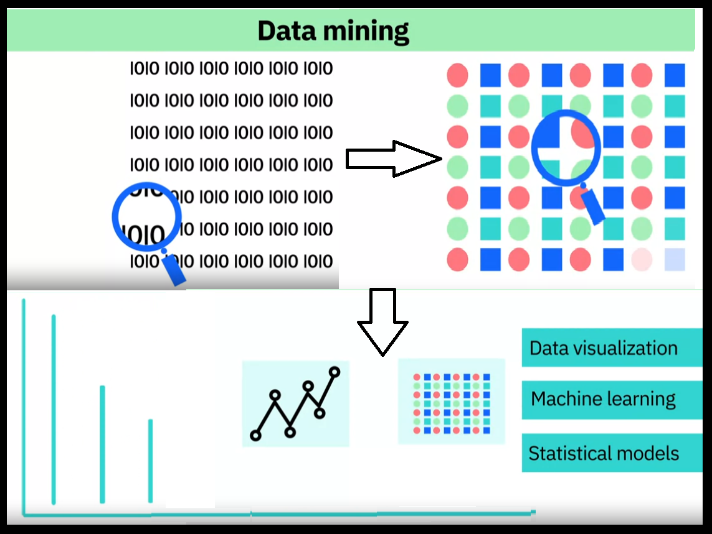
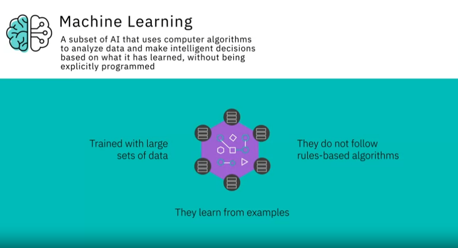
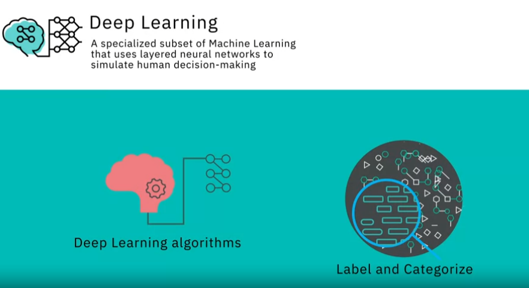
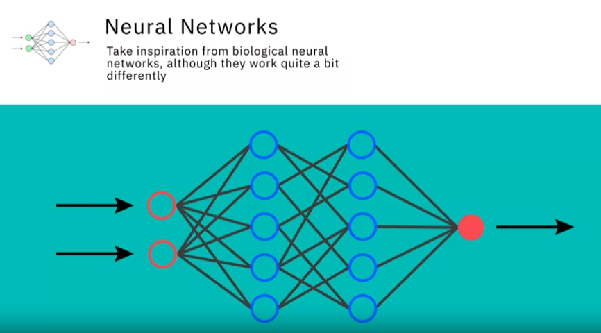
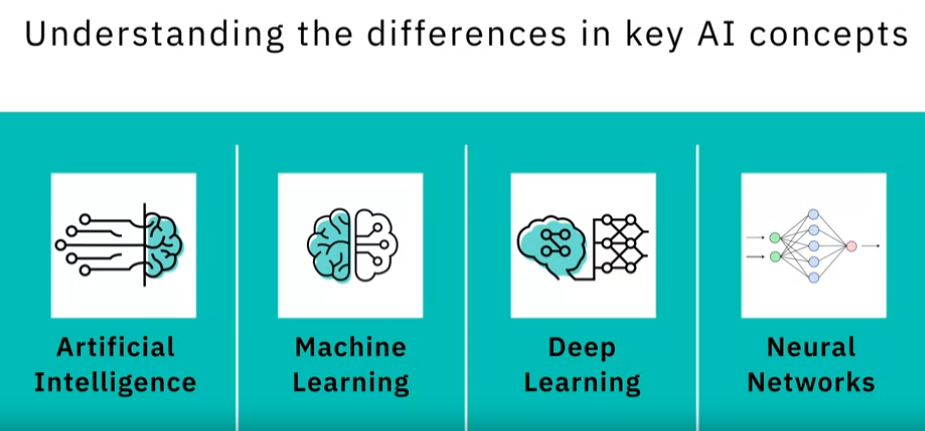
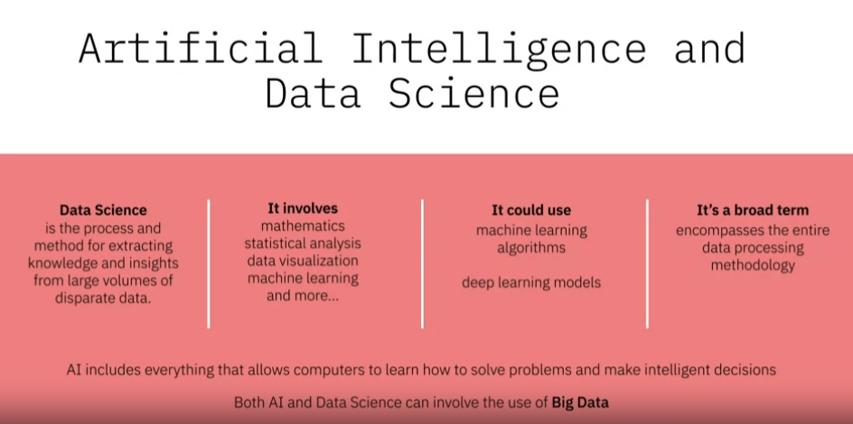

# Data Science, Artificial Intelligence, Big data, Data Mining,  Machine Learning and Deep Learning; Definition and it's differences

### Big Data : 
- The term big data refers to data sets that are so massive, so quickly built, and so varied that they defy traditional analysis methods such as you might perform with a relational database. The concurrent development of enormous compute power in distributed networks and new tools and techniques for data analysis means that organizations now have the power to analyze these vast data sets. A new knowledge and insights are becoming available to everyone. Big data is often described in terms of five V's;

    ``velocity, volume, variety, veracity, and value.``

    
    
### Data Mining :
 - Data mining is the process of automatically searching and analyzing data, discovering previously unrevealed patterns. It involves preprocessing the data to prepare it and transforming it into an appropriate format. Once this is done, insights and patterns are mined and extracted using various tools and techniques ranging from simple data visualization tools to machine learning and statistical models. 

 
 
 ### Machine Learning :
 - Machine learning is a subset of AI that uses computer algorithms to analyze data and make intelligent decisions based on what it is learned without being explicitly programmed. Machine learning algorithms are trained with large sets of data and they learn from examples. They do not follow rules-based algorithms. Machine learning is what enables machines to solve problems on their own and make accurate predictions using the provided data. 

 
 
 ### Deep Learning :
 - Deep learning is a specialized subset of machine learning that uses layered neural networks to simulate human decision-making. Deep learning algorithms can label and categorize information and identify patterns. It is what enables AI systems to continuously learn on the job and improve the quality and accuracy of results by determining whether decisions were correct.

 
 
- Artificial neural networks, often referred to simply as neural networks, take inspiration from biological neural networks, although they work quite a bit differently. A neural network in AI is a collection of small computing units called neurons that take incoming data and learn to make decisions over time. Neural networks are often layer-deep and are the reason deep learning algorithms become more efficient as the data sets increase in volume, as opposed to other machine learning algorithms that may plateau as data increases.

Now that you have a broad understanding of the differences between some key AI concepts, there is one more differentiation that is important to understand that between Artificial Intelligence and Data Science.

### Data Science :
- Data Science is the process and method for extracting knowledge and insights from large volumes of disparate data. It's an interdisciplinary field involving mathematics, statistical analysis, data visualization, machine learning, and more. It's what makes it possible for us to appropriate information, see patterns, find meaning from large volumes of data and use it to make decisions that drive business. 

- Data Science can use many of the AI techniques to derive insight from data. For example, it could use machine learning algorithms and even deep learning models to extract meaning and draw inferences from data. There is some interaction between AI and Data Science, but one is not a subset of the other. Rather, Data Science is a broad term that encompasses the entire data processing methodology while AI includes everything that allows computers to learn how to solve problems and make intelligent decisions. Both AI and Data Science can involve the use of big data.

